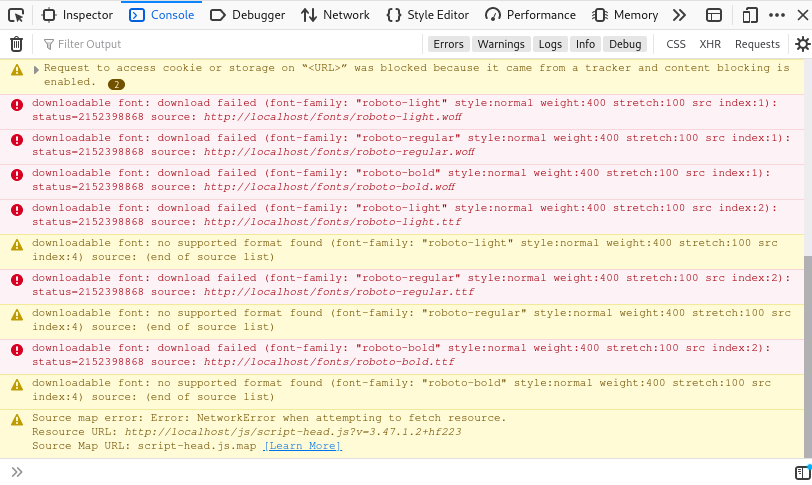
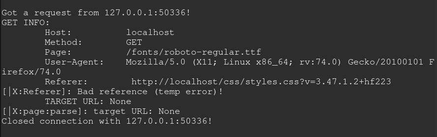

# Murl
> MITM attack that loads a requested page served by you.
> This means the user can use and request any site, but the page will be hosted on your hardware, allowing control over user's experience

---

## Notes (for me):
- Maybe make a wheel for easy installation?
- Make sure the app works at a basic level before checking for errors and extra details and such!
- Keep a persistent connection with the client until all data is properly loaded

#### -= Important Notes Section =-
+ Change links to personal url (change contents of requests.text)!
+ Make sure the GET request is understood by the app!
+ Make the server show a "loading" page while it tries to recover everything it needs from the site (css, javascript)
	+ Alternatively, just make the loading faster (async?)

## Dependencies
- [Sockets](https://docs.python.org/3/howto/sockets.html)
- [Requests](https://requests.readthedocs.io/en/master/)
- [Beautiful Soup](https://pypi.org/project/beautifulsoup4/)

## Future Implementations:
- Make the app change the url to appear as if it was coming from the legitimate URL, snuffing suspicion

## References
> This section is used for references in the code, such as specific errors, etc

- Bad request
```
Got a request from 127.0.0.1:45334!
GET INFO: {'method': 'GET', 'page': '/images/ic-auth@3x.png', 'version': 'HTTP/1.1', 'Host': 'localhost', 'User-Agent': 'Mozilla/5.0 (X11; Linux x86_64; rv:74.0) Gecko/20100101 Firefox/74.0', 'Accept': 'image/webp,*/*', 'Accept-Language': 'en-US,en;q=0.5', 'Accept-Encoding': 'gzip, deflate', 'Connection': 'keep-alive', 'Referer': 'http://localhost/styles/production.min.css?v=1.12.3'}
[|X:page:parse]: target URL: //localhost/images/ic-auth@3x.png
Traceback (most recent call last):
  File "./murl.py", line 60, in <module>
    main()
  File "./murl.py", line 52, in main
    req=requests.get(target_url)
  File "/usr/lib/python3.8/site-packages/requests/api.py", line 76, in get
    return request('get', url, params=params, **kwargs)
  File "/usr/lib/python3.8/site-packages/requests/api.py", line 61, in request
    return session.request(method=method, url=url, **kwargs)
  File "/usr/lib/python3.8/site-packages/requests/sessions.py", line 516, in request
    prep = self.prepare_request(req)
  File "/usr/lib/python3.8/site-packages/requests/sessions.py", line 449, in prepare_request
    p.prepare(
  File "/usr/lib/python3.8/site-packages/requests/models.py", line 314, in prepare
    self.prepare_url(url, params)
  File "/usr/lib/python3.8/site-packages/requests/models.py", line 388, in prepare_url
    raise MissingSchema(error)
requests.exceptions.MissingSchema: Invalid URL '//localhost/images/ic-auth@3x.png': No schema supplied. Perhaps you meant http:////localhost/images/ic-auth@3x.png?
```

- No reference
```
Got a request from 127.0.0.1:46764!
GET INFO: {'method': 'GET', 'page': '/yts/img/favicon_144-vfliLAfaB.png', 'version': 'HTTP/1.1', 'Host': 'localhost', 'User-Agent': 'Mozilla/5.0 (X11; Linux x86_64; rv:74.0) Gecko/20100101 Firefox/74.0', 'Accept': 'image/webp,*/*', 'Accept-Language': 'en-US,en;q=0.5', 'Accept-Encoding': 'gzip, deflate', 'Connection': 'keep-alive', 'Cookie': 'has_js=1; _gauges_unique_hour=1; _gauges_unique_day=1; _gauges_unique_month=1; _gauges_unique_year=1; _gauges_unique=1; ss_cvr=e5d5c726-c4a2-40a1-82de-180557056363|1589161240280|1589161240280|1589161240280|1; ss_cvt=1589161240280'}
[|X:page:parse]: target URL: None
Traceback (most recent call last):
  File "./murl.py", line 64, in <module>
    main()
  File "./murl.py", line 56, in main
    req=requests.get(target_url)
  File "/usr/lib/python3.8/site-packages/requests/api.py", line 76, in get
    return request('get', url, params=params, **kwargs)
  File "/usr/lib/python3.8/site-packages/requests/api.py", line 61, in request
    return session.request(method=method, url=url, **kwargs)
  File "/usr/lib/python3.8/site-packages/requests/sessions.py", line 516, in request
    prep = self.prepare_request(req)
  File "/usr/lib/python3.8/site-packages/requests/sessions.py", line 449, in prepare_request
    p.prepare(
  File "/usr/lib/python3.8/site-packages/requests/models.py", line 314, in prepare
    self.prepare_url(url, params)
  File "/usr/lib/python3.8/site-packages/requests/models.py", line 388, in prepare_url
    raise MissingSchema(error)
requests.exceptions.MissingSchema: Invalid URL 'None': No schema supplied. Perhaps you meant http://None?
```

- Failed to download


